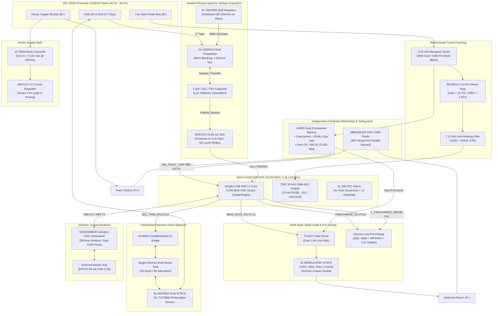

# SmartBMS: 16S 100Ah Active-Balancing LiFePO4 Satellite BMS

[-blue.svg?style=flat-square)](#system-specifications--operational-targets)
[](#system-specifications--operational-targets)
[-orange.svg?style=flat-square)](#system-architecture)
[-purple.svg?style=flat-square)](#microcontroller-pin-allocation)
[](#component-bill-of-materials-bom)
[](#subsystem-specifications)

A high-power, modular, stackable **16S 100Ah (200A continuous / 250A surge) LiFePO4 Smart Battery Management System (BMS) Satellite Board** engineered for stationary Home Energy Storage Systems (HESS), off-grid solar storage, and inverter backup banks.

Designed to eliminate reliance on proprietary, cost-prohibitive integrated front-end ASICs, this architecture combines an **Odd/Even Flying-Capacitor Analog Front End (AFE)**, **16 kHz oversampled Kelvin shunt current measurement**, a **2.0A–3.0A centralized inductive active balancer**, an **autonomous sub-5µs analog watchdog**, and **galvanically isolated CAN 2.0B telemetry** powered by a 32-bit RISC-V microcontroller.

---

## System Specifications & Operational Targets

| Parameter | Operational Value | Engineering Notes & Tolerances |
| :--- | :--- | :--- |
| **Pack Chemistry & Configuration** | **16S LiFePO4** | $51.2\text{ V}$ nominal ($40.0\text{ V}$ cut-off, $58.4\text{ V}$ absorption max) |
| **Continuous Current Rating** | **$200\text{ A}$ continuous** | Charge and discharge through low-side solid-state switch bank |
| **Surge Current Rating** | **$250\text{ A}$ peak** | Permitted for $<10\text{ s}$ during inductive motor / inverter start |
| **System Scalability** | **Up to 96V nominal** | Stackable in series ($102.4\text{ V}$ nominal / $116.8\text{ V}$ max charging) |
| **Control Architecture** | **Modular Satellite** | Executes local sensing, active balancing, and safety trips; streams telemetry via CAN 2.0B |
| **Microcontroller (MCU)** | **WCH CH32V203C8T6** | 32-bit RISC-V QingKe V4B @ 144 MHz, LQFP-48 package |
| **Timing Engine (HSE)** | **8.000 MHz Crystal** | $\le \pm 20\text{ ppm}$ quartz crystal for drift-free CAN protocol bit timing |
| **Target Hardware Budget** | **$< ₹5,000 INR** | Complete verified component BOM is **₹4,344 INR** using standard catalog parts |

---

## System Architecture



---

## Subsystem Specifications

### 1. Cell Voltage Acquisition (AFE)
* **Odd/Even Flying-Capacitor Matrix**: 17 cell taps ($B_0$ to $B_{16}$) route into two isolated internal rails:
  * **Even Rail**: Taps $0, 2, 4, 6, 8, 10, 12, 14, 16$ (9 switches).
  * **Odd Rail**: Taps $1, 3, 5, 7, 9, 11, 13, 15$ (8 switches).
* **Isolation Switching**: 11 dual-channel **AQW214** PhotoMOS relays ($400\text{ V}$ off-state blocking, $1,500\ \text{V}_{\text{RMS}}$ isolation). 17 channels connect to cell taps; 4 channels form an H-bridge polarity reverser mapping unipolar $0\text{ to }3.65\text{ V}$ onto the ADC regardless of whether an odd or even cell is being sampled.
* **Storage Element**: $1.0\ \mu\text{F}$ 100V C0G ceramic or polypropylene film capacitor chosen for low dielectric absorption and zero DC bias degradation.
* **Hardware Interlock**: Driven by three cascaded **74HC595** shift registers via hardware SPI. MCU pin `PB11` directly controls Output Enable (`OE`). `OE` is held HIGH during register shifting to physically de-energize all PhotoMOS LEDs, preventing shoot-through shorts across adjacent cell taps.
* **Timing Sequence**: Break-before-make sequence: $3.0\text{ ms}$ charge acquisition $\rightarrow$ $1.0\text{ ms}$ dead-time $\rightarrow$ $4.0\text{ ms}$ read/ADC conversion $\rightarrow$ $1.0\text{ ms}$ discharge reset ($\approx 9.0\text{ ms}$ per cell, $\approx 144\text{ ms}$ full 16-cell cycle).
* **ADC Configuration**: **ADS1115** 16-bit Sigma-Delta ADC powered from the $5.0\text{ V}$ rail to ensure positive analog input headroom ($V_{\text{DD}} + 0.3\text{ V} = 5.3\text{ V}$) well above the $3.65\text{ V}$ maximum cell voltage. Interfaces to the 3.3V MCU via a dual BSS138 bidirectional level shifter.

### 2. High-Speed Current Sensing & Coulomb Counting
* **Shunt Resistor**: $0.25\ \text{m}\Omega$ electron-beam welded copper-manganin shunt block rated for $36\text{ W}$ continuous / $50\text{ W}$ peak. Static dissipation at $200\text{ A}$ is $P = 200^2 \times 0.00025 = 10.0\text{ W}$ (only $27.7\%$ of continuous rating).
* **Current Sense Amplifier**: **INA181A1IDBVR** (Gain = $20\text{ V/V}$, bidirectional, 350 kHz bandwidth).
  * Mid-rail reference: $V_{\text{REF}} = 1.65\text{ V}$ generated by a precision $10\text{ k}\Omega / 10\text{ k}\Omega\ 0.1\%$ divider decoupled with $1.0\ \mu\text{F}$.
  * $-200\text{ A}$ (Full Charge): $0.65\text{ V}$ ($ADC \approx 807$).
  * $0\text{ A}$ (Idle): $1.65\text{ V}$ ($ADC \approx 2048$).
  * $+200\text{ A}$ (Full Discharge): $2.65\text{ V}$ ($ADC \approx 3289$).
  * $+250\text{ A}$ (Surge Limit): $2.90\text{ V}$ ($ADC \approx 3600$, maintaining $400\text{ mV}$ linear margin below $3.3\text{ V}$).
* **Anti-Aliasing Filter**: $R = 100\ \Omega\ 1\%$, $C = 220\text{ nF}$ X7R:
  $$f_c = \frac{1}{2\pi \times 100\ \Omega \times 220\text{ nF}} \approx 7.23\text{ kHz}$$
  Attenuates high-frequency inverter carrier noise before the $8\text{ kHz}$ Nyquist threshold.
* **Sampling Engine**: MCU Timer 2 triggers `ADC_IN0` (`PA0`) at $16\text{ kHz}$. DMA circular buffering streams samples into a 64-word array. Summation decimation yields 15-bit ENOB with a resolution of $\approx 20.1\text{ mA/count}$.

### 3. 200A Cutoff Switch, Pre-Charge & Mechanics
* **Main Switch Bank**: Six parallel **IRFB4110PBF** N-Channel MOSFETs ($100\text{ V}$, $180\text{ A}$, $R_{\text{DS(on)}} \le 4.5\ \text{m}\Omega$) in TO-220 packages on the low-side return (`B-` to `P-`).
  * Combined bank resistance: $R_{\text{bank}} \approx 0.65\text{--}0.75\ \text{m}\Omega$.
  * Static dissipation at $200\text{ A}$: $26\text{ W to }30\text{ W}$ total ($\approx 4.5\text{ W to }5.0\text{ W}$ per transistor).
  * Gate Drive: **TC4427EOA** dual $1.5\text{ A}$ high-speed driver with individual $10\ \Omega$ gate resistors and a dedicated Kelvin source return trace routed directly to the center of the MOSFET source bank.
  * Thermal Interface: Extruded aluminum profile ($R_{\theta} \le 0.8^\circ\text{C/W}$) with silicone phase-change thermal interface material.
* **High-Current Busbars**: Low-inductance **$25\text{ mm} \times 3\text{ mm}$ ($75\text{ mm}^2$) tinned ETP copper busbar** ($2.67\text{ A/mm}^2$ current density at $200\text{ A}$, guaranteeing $<15^\circ\text{C}$ temperature rise). Primary power terminals use **M8 tinned copper studs** clamped with M3 stainless steel fasteners and Belleville spring washers.
* **Closed-Loop Pre-Charge Branch**:
  * Resistor: $30\ \Omega\text{ / }50\text{ W}$ aluminum-housed wirewound (peak inrush capped to $1.7\text{ A}$).
  * Switch: **IRF540N** driven by MCU pin `PC14`.
  * Voltage Feedback: $1\ \text{M}\Omega / 20\ \text{k}\Omega$ divider ($1:51$ ratio) on MCU pin `PA1` (`ADC_IN1`). The main FETs engage only when terminal voltage drop confirms the load DC-bus capacitors have charged to $\ge 95\%$ ($V_{\text{drop}} \le 2.5\text{ V}$). A $1.5\text{ s}$ timer acts as a fault abort.

### 4. Centralized Inductive Active Balancer
* **Topology**: Single-inductor buck-boost energy shuttler operating on an Odd/Even switching matrix.
* **Storage Inductor**: $15\ \mu\text{H to }22\ \mu\text{H}$ shielded drum/toroid inductor with saturation current $I_{\text{sat}} \ge 6.0\text{ A}$.
* **Matrix Switches**: 8 dual N-Channel MOSFETs (**AO4406A / AO4800**, 30V, 8A) driven by 16 isolated photovoltaic gate drivers (**TLP3906**), with polarity directed by two complementary N+P pairs (**AO4606**).
* **Balancing Capability**: Transfers $2.0\text{ A to }3.0\text{ A}$ of charge directly from the highest-potential cell to the lowest-potential cell.
* **Measurement Blanking**: Balancer PWM pauses for $15\text{ ms}$ before and during flying-capacitor reads to eliminate $I \cdot R$ harness drop sampling errors.

### 5. Secondary Safety Watchdog & 96V Series Safeguards
* **Independent Analog Watchdog (LM393DR)**: Fully autonomous hardware comparator circuit operating independently of MCU firmware:
  * **Channel 1 (Short Circuit)**: References the $0.25\ \text{m}\Omega$ shunt. Pulls the TC4427 driver input LOW and asserts MCU interrupt `PB0` in **$<5\ \mu\text{s}$** if current exceeds **$250\text{ A}$** ($V_{\text{shunt}} \ge 62.5\text{ mV}$).
  * **Channel 2 (Pack Overvoltage)**: Compares a $100\text{ k}\Omega / 4.32\text{ k}\Omega\ 0.1\%$ divider against a **TL431 ($2.495\text{ V} \pm 0.5\%$)** voltage reference, tripping at **$60.3\text{ V} \pm 0.3\text{ V}$**.
* **96V String Protection Diode**: An **MBR200100** ($100\text{ V}$, $200\text{ A}$) Schottky diode bolted across `P+` (cathode) and `P-` (anode). If one pack in a 96V series string trips open while the other pack continues discharging, the diode forward-biases, clamping reverse voltage across the open MOSFET bank to $-0.7\text{ V}$ and preventing drain-source avalanche destruction.

### 6. Power Supply Subsystem
* **High-Voltage Step-Down**: **XL7005A** non-synchronous buck converter with external **SS210** Schottky catch diode and $100\ \mu\text{H}$ inductor, stepping $40\text{ V to }58.4\text{ V}$ down to $5.0\text{ V}$.
* **Linear Post-Regulation**: **AMS1117-3.3** stepping $5.0\text{ V}$ down to clean $3.3\text{ V}$ logic rails.
* **Parasitic Draw**: Total quiescent current on the $5\text{ V}$ rail is $\approx 30\text{ mA}$, which reflects to $\approx 5.3\text{ mA}$ drawn from the $51.2\text{ V}$ pack ($\approx 6.55\text{ Wh/day}$, or $0.128\%$ of nominal pack capacity per day).

---

## Microcontroller Pin Allocation

All 37 available GPIOs on the **CH32V203C8T6 (LQFP-48)** are mapped without peripheral conflicts:

| Pin # | Pin Name | Peripheral Mapping | Net / Signal Function |
| :---: | :--- | :--- | :--- |
| **1** | `VBAT` | Power | Tied to `+3V3` (100nF decoupling) |
| **2** | `PC13` | GPIO Output | `MAIN_GATE_EN` (To TC4427 Driver Input via 100Ω) |
| **3** | `PC14` | GPIO Output | `PRECHARGE_GATE_EN` (To IRF540N Precharge Gate) |
| **4** | `PC15` | GPIO Output | `BAL_PWM_EN` (Active Balancer PWM Direction Enable) |
| **5** | `PD0/OSCIN` | RCC_OSC_IN | 8.000 MHz Crystal Pin 1 (22pF to GND) |
| **6** | `PD1/OSCOUT` | RCC_OSCOUT | 8.000 MHz Crystal Pin 2 (22pF to GND) |
| **7** | `NRST` | Reset | Active-Low Reset (10kΩ pull-up + 100nF to GND) |
| **8** | `VSSA` | Analog GND | `AGND` Star-Ground Reference |
| **9** | `VDDA` | Analog Power | `+3V3A` (Filtered via Ferrite Bead + 1µF/100nF) |
| **10** | `PA0` | `ADC_IN0` / TIM2_TRGO | `ISENSE_FILT` (From INA181 100Ω/220nF RC Filter) |
| **11** | `PA1` | `ADC_IN1` | `V_PRECHARGE_SENSE` (1MΩ / 20kΩ Divider from Load P-) |
| **12** | `PA2` | `USART1_TX` | Debug Console UART TX |
| **13** | `PA3` | `USART1_RX` | Debug Console UART RX |
| **14** | `PA4` | `ADC_IN4` | `NTC1_SENSE` (Cells 1–4 Quadrant) |
| **15** | `PA5` | `ADC_IN5` | `NTC2_SENSE` (Cells 5–8 Quadrant) |
| **16** | `PA6` | `ADC_IN6` | `NTC3_SENSE` (Cells 9–12 Quadrant) |
| **17** | `PA7` | `ADC_IN7` | `NTC4_SENSE` (Cells 13–16 Quadrant) |
| **18** | `PB0` | `EXTI0` | `HW_FAULT_TRIP` (From LM393 Watchdog Comparator) |
| **19** | `PB1` | `ADC_IN9` | `NTC5_SENSE` (MOSFET Heatsink / Inductor Probe) |
| **20** | `PB2/BOOT1` | Boot Config | Tied to `GND` via 10kΩ Pull-Down |
| **22** | `PB11` | GPIO Output | `SR_OE_N` (74HC595 Output Enable / Hardware Interlock) |
| **25** | `PB12` | `SPI1_NSS` | `SR_LATCH` (74HC595 Storage Clock / RCLK) |
| **26** | `PB13` | `SPI1_SCK` | `SR_SCK` (74HC595 Shift Clock / SRCLK) |
| **28** | `PB15` | `SPI1_MOSI` | `SR_SER_DATA` (74HC595 Serial Data In) |
| **42** | `PB6` | `I2C1_SCL` | `I2C1_SCL_3V3` (To ADS1115 via BSS138 Level Shifter) |
| **43** | `PB7` | `I2C1_SDA` | `I2C1_SDA_3V3` (To ADS1115 via BSS138 Level Shifter) |
| **44** | `BOOT0` | Boot Config | 10kΩ Pull-down to `GND` (Button to `+3V3`) |
| **45** | `PB8` | `CAN_RX` | From ISO1042 Galvanic Transceiver Pin 2 |
| **46** | `PB9` | `CAN_TX` | To ISO1042 Galvanic Transceiver Pin 3 |
| **23, 35, 47** | `VSS_1/2/3` | Digital GND | `GND` Digital Ground Plane |
| **24, 36, 48** | `VDD_1/2/3` | Digital Power | `+3V3` Digital Supply (100nF decoupling at each pin) |

---

## Component Bill of Materials (BOM)

Verified pricing based on standard retail distributors in India (*ElectronicsComp, Robu.in, Evelta, Zbotic*):

| # | Subsystem | Part Number / Component | Package | Critical Parameters | Qty | Unit (INR) | Ext. Cost (INR) |
| :-: | :--- | :--- | :--- | :--- | :-: | :-: | :-: |
| 1 | **MCU & Logic** | **WCH CH32V203C8T6** | LQFP-48 | 32-bit RISC-V, 144 MHz, CAN 2.0B | 1 | ₹110 | ₹110 |
| 2 | **CAN Clock** | **8.000 MHz Crystal** | HC-49S / SMD | $\pm 20\text{ ppm}$ with 2× 22pF C0G caps | 1 set | ₹16 | ₹16 |
| 3 | **Current Shunt** | **0.25 mΩ Manganin Shunt** | M8 Lug Block | $0.25\ \text{m}\Omega$, 36W cont / 50W pk, 4-terminal | 1 | ₹350 | ₹350 |
| 4 | **Current Amp** | **INA181A1IDBVR** | SOT-23-6 | Bidirectional CSA, Gain = 20 V/V, 350 kHz | 1 | ₹45 | ₹45 |
| 5 | **V_REF Divider** | Precision 10.0k 0.1% Resistors | 0805 SMD | Precision mid-rail divider ($1.65\text{ V}$) + $1\mu\text{F}$ | 1 set | ₹8 | ₹8 |
| 6 | **Cell ADC Engine**| **ADS1115IDGSR** | MSOP-10 | 16-bit $\Delta\Sigma$, dedicated to flying cap on 5V rail | 1 | ₹120 | ₹120 |
| 7 | **I2C Level Shifter**| 2× BSS138 + Pull-ups | SOT-23 / 0805 | Bidirectional 3.3V $\leftrightarrow$ 5.0V I2C translator | 1 set | ₹15 | ₹15 |
| 8 | **Tap/Read Switches**| **AQW214** | SOP-8 | Dual PhotoMOS, 400V blocking, $1500\text{V}_{\text{RMS}}$ | 11 | ₹65 | ₹715 |
| 9 | **Mux Shift Regs** | **74HC595D** | SOIC-16 | 8-bit serial shift registers (24 outputs total) | 3 | ₹15 | ₹45 |
| 10 | **Flying Capacitor**| C0G / Polypropylene Film | Box / Radial | $1.0\ \mu\text{F}$, 100V, low-dielectric absorption | 1 | ₹25 | ₹25 |
| 11 | **HV Buck Controller**| **XL7005A** | SOP-8 | $80\text{V}$ max input buck, 5.0V output rail | 1 | ₹35 | ₹35 |
| 12 | **Buck Catch Diode**| **SS210** | SMA | 100V, 2A Schottky freewheeling diode | 1 | ₹6 | ₹6 |
| 13 | **Buck Inductor** | Shielded Power Inductor | SMD $12\times 12\text{ mm}$| $100\ \mu\text{H}$, $1.0\text{ A}$ minimum saturation current | 1 | ₹25 | ₹25 |
| 14 | **Logic LDO** | **AMS1117-3.3** | SOT-223 | $5.0\text{V} \to 3.3\text{V}$ LDO for MCU & analog rail | 1 | ₹8 | ₹8 |
| 15 | **Isolated CAN** | **ISO1042BDW** | SOIC-8 Wide | Galvanic isolated CAN transceiver, 5 kVrms | 1 | ₹160 | ₹160 |
| 16 | **CAN Termination** | 120 Ω 1% + Jumper | 0805 | Bus termination resistor | 1 set | ₹4 | ₹4 |
| 17 | **Balancer Inductor**| Shielded Drum Inductor | Radial / SMD | $15\ \mu\text{H}\text{ to }22\ \mu\text{H}$, $I_{\text{sat}} \ge 6.0\text{ A}$ | 1 | ₹45 | ₹45 |
| 18 | **Balancer H-Bridge**| **AO4606** | SOIC-8 | 30V, 6A Complementary N+P pair | 2 | ₹18 | ₹36 |
| 19 | **Matrix Switches** | **AO4406A / AO4800** | SOIC-8 | Dual N-Channel 30V, 8A | 8 | ₹15 | ₹120 |
| 20 | **Matrix Drivers** | **TLP3906** | SOIC-4 | Photovoltaic isolated gate driver | 16 | ₹35 | ₹560 |
| 21 | **200A Cutoff FETs**| **IRFB4110PBF** | TO-220 | 100V, 180A, $R_{\text{DS(on)}} \le 4.5\ \text{m}\Omega$ | 6 | ₹95 | ₹570 |
| 22 | **MOSFET Driver** | **TC4427EOA** | SOIC-8 | Dual 1.5A high-speed low-side driver | 1 | ₹45 | ₹45 |
| 23 | **Pre-Charge Branch**| 30 Ω / 50 W + IRF540N | Wirewound + TO-220 | Inrush limiter ($1.7\text{ A}$) + switch + divider | 1 set | ₹145 | ₹145 |
| 24 | **Hardware Watchdog**| **LM393DR + TL431 (0.5%)** | SOIC-8 / TO-92 | Short circuit ($>250\text{A}$) & pack OV ($60.0\text{V}$) | 1 set | ₹16 | ₹16 |
| 25 | **Pack Thermistors**| **NTC 3950 10k Probes** | Ring Lug / Bead | 4× Pack quadrants + 1× MOSFET Heatsink | 5 | ₹20 | ₹100 |
| 26 | **96V Bypass Diode** | **MBR200100** | TO-247 / Module | 100V, 200A anti-parallel Schottky diode | 1 | ₹280 | ₹280 |
| 27 | **Power Terminals** | **M8 Tinned Copper Studs** | Threaded Post / Lug | 200A rated tinned electrolytic copper | 2 pairs | ₹220 | ₹440 |
| 28 | **Connectors/Comms**| JST-XH 17-pin, Dual RJ45 | Through-hole | Cell harness input + dual CAN ports | 1 set | ₹120 | ₹120 |
| 29 | **Passives/Protection**| 0805 Caps, Resistors, TVS | SMD / Discrete | Decoupling caps, 10Ω gate resistors, TVS | 1 set | ₹180 | ₹180 |
| **TOTAL** | | | | | | | **₹4,344 INR** |

---

## Phased Build & Test Pipeline

```
+─────────────────────────────────────────────────────────────────────────────+
|                          PHASED BUILD & TEST PIPELINE                       |
+─────────────────────────────────────────────────────────────────────────────+
                                       │
                                       ▼
  [ PHASE 1: AFE PROTOTYPE ]
  • Assemble a 2-cell / 4-cell test bench with 3x AQW214 and 1x 74HC595.
  • Validate actual settling time of the 1.0µF C0G capacitor via oscilloscope.
  • Confirm break-before-make dead-time on OE line prevents tap shoot-through.
                                       │
                                       ▼
  [ PHASE 2: POWER SUPPLY & MCU CORE ]
  • Bring up XL7005A buck converter under a 40V-60V bench DC supply.
  • Verify 5.0V intermediate and 3.3V logic rails.
  • Flash WCH CH32V203 core via WCH-Link; verify 8.000 MHz HSE crystal locking.
  • Confirm CAN 2.0B loopback frames against an external USB-CAN dongle.
                                       │
                                       ▼
  [ PHASE 3: CURRENT SENSING & WATCHDOG VALIDATION ]
  • Test INA181A1 with precision DC current injection across the 0.25mΩ shunt.
  • Calibrate 16 kHz Timer2 ADC DMA oversampling; verify 1.65V zero-point.
  • Validate LM393 response time (<5µs trip) by applying a 65mV test pulse.
                                       │
                                       ▼
  [ PHASE 4: POWER STAGE & THERMAL INTEGRATION ]
  • Bolt 6x IRFB4110 MOSFETs to the 25x3mm copper busbar and heatsink.
  • Connect pre-charge resistor and verify closed-loop voltage drop logic.
  • Thermal soak test at 100A, 150A, and 200A continuous on a resistive load bank.
```

---

## Automated Git Save Tracker for KiCad

To streamline hardware development in **KiCad EDA**, this repository includes a dedicated background save tracker (`git_tracker.py`):

### How It Works
* **Ignores Autosaves & Locks**: KiCad generates frequent recovery files (`_autosave-*`), lock files (`*.lck`, `~*.lck`), backup zips (`*-backups/`), and local user viewports (`*.kicad_prl`). These are strictly filtered out by `.gitignore` and tracker logic.
* **Tracks Real File Saves**: Only explicit user saves (`Ctrl+S`) to primary hardware and source files (`*.kicad_sch`, `*.kicad_pcb`, `*.kicad_pro`, documentation, scripts) trigger tracking.
* **Debounced Auto-Commit & Push**: When a save occurs, the tracker waits a 2.5-second debounce window (allowing multi-sheet saves to settle), automatically stages modified files, generates an informative timestamped commit message, and pushes directly to `origin/main`.

### Usage
```bash
# Start the background tracker
./start_tracker.sh

# View live tracker logs
tail -f tracker.log

# Stop the tracker
./stop_tracker.sh
```

---

## Authorship & License

- **Author**: Kausthubh Viswanath ([@koko69420](https://github.com/koko69420))
- **Status**: Active Hardware Development
- **License**: Hardware & Firmware specifications are maintained under private academic/engineering copyright. All rights reserved.
